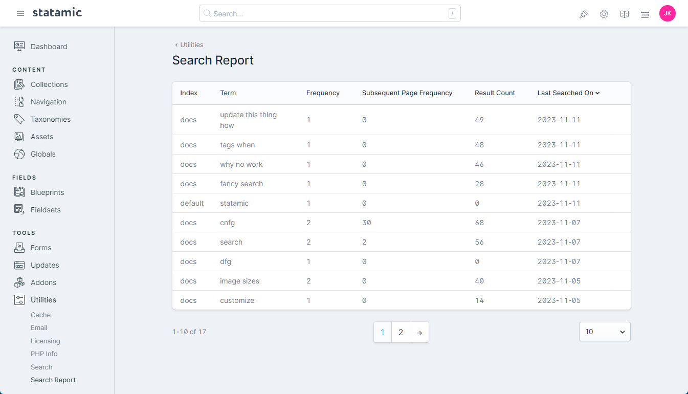

# Search Report for Statamic

Search Report for Statamic is a simple Control Panel and utility addon that allows you to log searches made on your site, and view them within Statamic's Control Panel.

## How to Install

You can install Search Report for Statamic by running the following command from the root of your project:

``` bash
composer require stillat/statamic-search-report
```

Because Search Report for Statamic includes pre-built assets required for the Control Panel report, you will need to publish the front-end assets if they were not automatically published for you. This can be done by running the following command:

```bash
php artisan vendor:publish --tag=statamic-search-report
```

Additionally, there is some configuration and setup required to use Search Report for Statamic. Make sure to publish the configuration files before proceeding:

```bash
php artisan vendor:publish --tag=statamic-search-report-config
```

## Setup

Search Report for Statamic stores search logs within a database, even if the rest of your site is using flat files. If you don't want to setup a large database server, you may also use SQLite. For more information on how to configure a database connection, please consider checking out Laravel's [Database: Getting Started](https://laravel.com/docs/10.x/database#configuration) page.

Regardless of which database engine you plan to use, you will need to first publish Search Report for Statamic's migration by running the following command:

> Note: If you want to change the database table name, make sure to update the `search_report.database.table` configuration option before running the following command.

```bash
php artisan search-report:search-term-logs-table
```

A new file will be created for you within your site's `database/migrations` folder.

By default, Search Report for Statamic will utilize your site's `database.default` database connection. You can change this by updating the `search_report.database.connection` configuration option. Once you have the database setup and configured for Search Report for Statamic you may run the following command to create your new database table:

```bash
php artisan migrate
```

## Templating

Because Statamic's search features do not emit any events, you will need to update your site's search results page in order to log searches. This can be done by inserting the `{{ log_search /}}` Antlers tag within your existing template:

```antlers
{{ search:results }}
    {{ log_search /}}
{{ /search:results }}
```

This will instruct Search Report for Statamic to create a new log entry after a response has been sent to your site's visitor. The `log_search` tag will attempt to find all its required information automatically, but this behavior can also be changed.

The following parameters are available when using the `log_search` tag:

```antlers
{{
    log_search
        term="the searched term"
        index="the-search-index"
        site="default"
        result_count="0"
        page="1"
/}}
```

| Name | Description |
|---|---|
| term | The user's search query. |
| index | The search index used to perform the search. |
| site | The site the search was performed within. |
| result_count | The total number of results returned. |
| page | The current page number, when using paginated results. |

> Note: In the event something has been misconfigured or is not working correctly, the `log_search` tag will log all exception's to your site's default log. It will *not* display the exception within the browser.

## What Gets Logged

Search Report for Statamic does not log anything beyond the following:

* `id`: A unique identifier for the search log itself. This does not have any correlation to the user, nor does it provide a way to uniquely identify an individual user
* `create_at`: The date and time a particular combination of search terms was *first* searched
* `updated_at`: The date and time a particular combination of search terms was *last* searched
* `index`: The Statamic search index used to perform the search
* `term`: The user's search term. This *may* include personal information, if the user entered personal information while performing a search on your site
* `site`: The Statamic site the search was performed within

Search Report for Statamic does *not* store each individual occurrence of a user's search, and only maintains aggregate counts of performed search terms. A search log is created for each unique `site`, `index` and `term` combination.

## The Search Report

Once visitors have made a few searches on your site, you can view them within Statamic's Control Panel by going to "Utilities > Search Report".



The search report provides a number of fields to help you make sense of your user's searches:

* Index: The Statamic search index used to perform the search
* Term: The search term supplied by the visitor
* Frequency: The number of times the unique index, term, and site combination was searched
* Subsequent Page Frequency: The number of times navigated past the first page of search results when displaying paginated results
* Result Count: The total number of results returned by the search term over time
* Last Searched On: The date and time the search term was last searched

## Clearing the Search Log

You may clear all entries in the search log by running the following command from the root of your project:

```bash
php artisan search-report:clear-search-term-logs
```

**Note**: This `search-report:clear-search-term-logs` command *truncates* the configured search term log table. Depending on how your database server is configured, the application user may not have permission to perform this operation. Under the conditions, you should consider other options for removing stored search logs.

## License

Search Report for Statamic is free software released under the MIT license.
